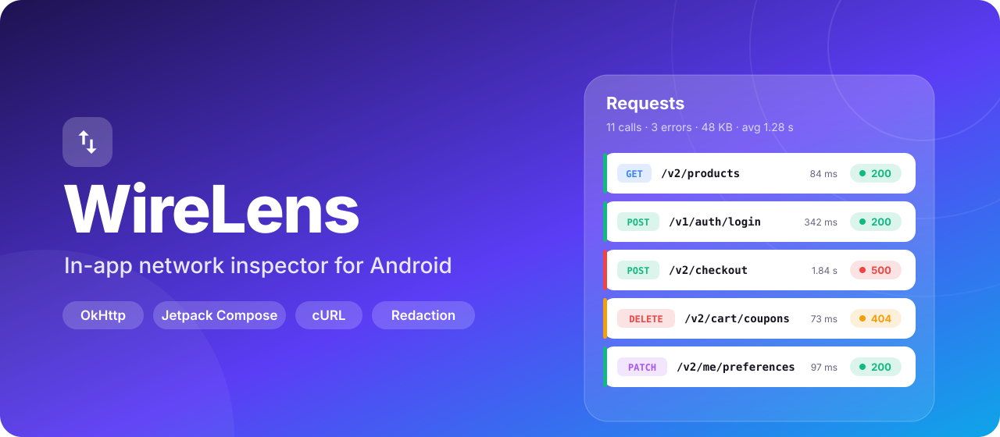
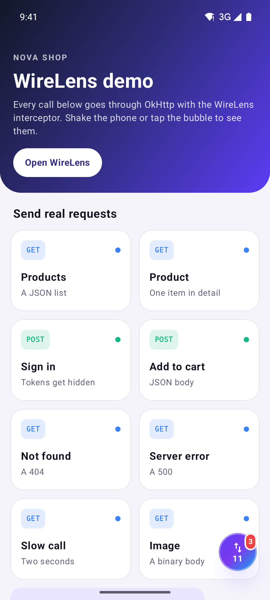
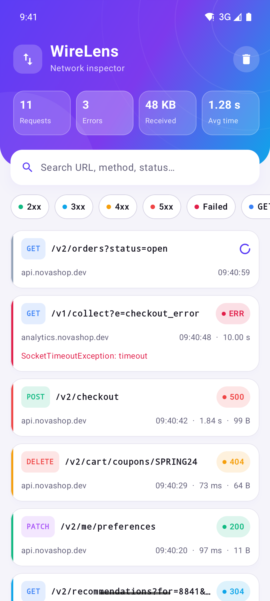
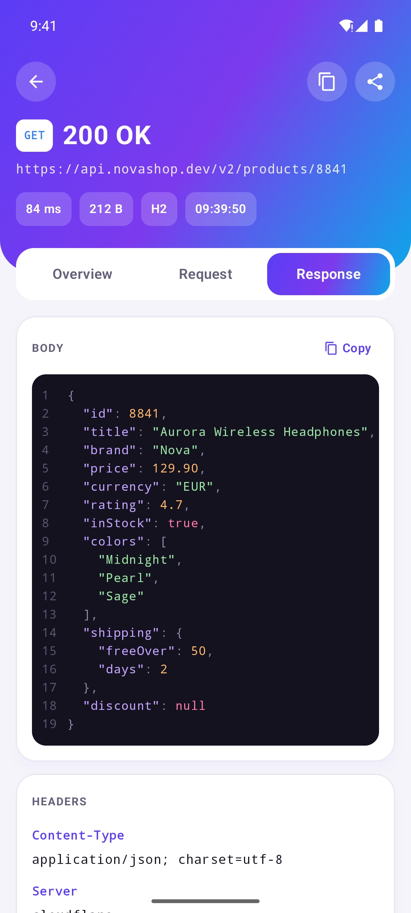
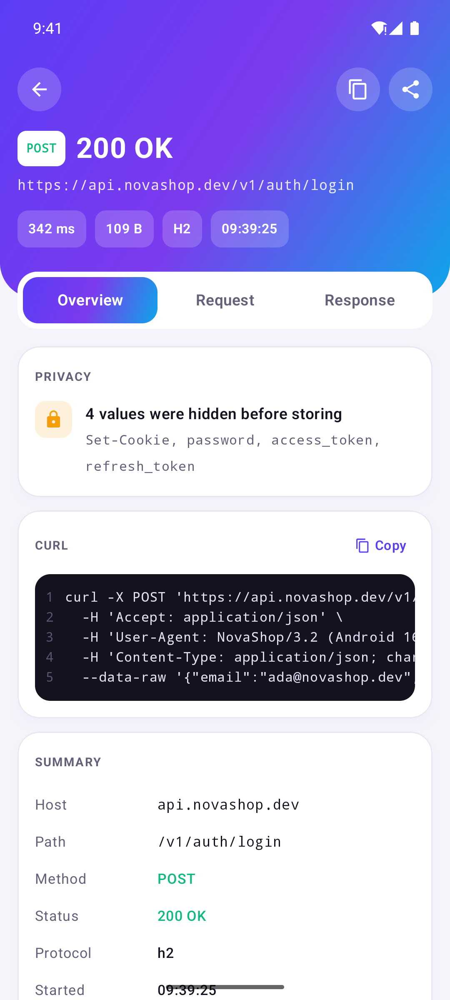
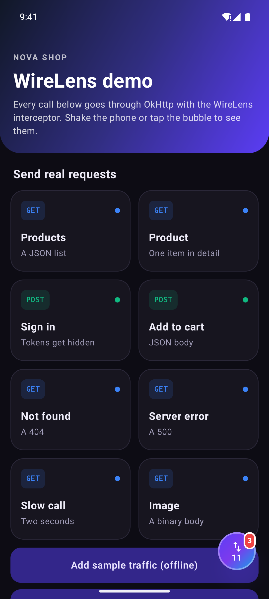
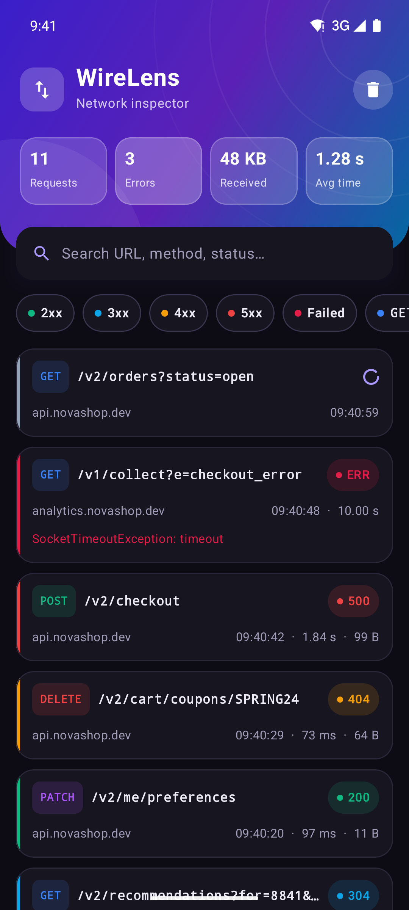
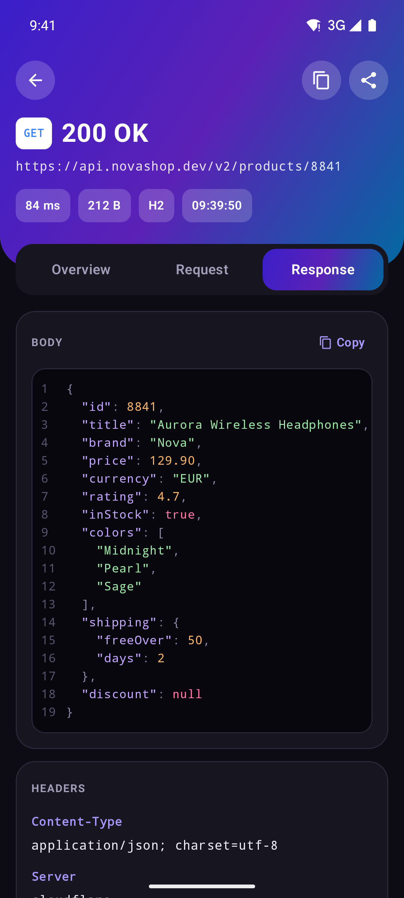
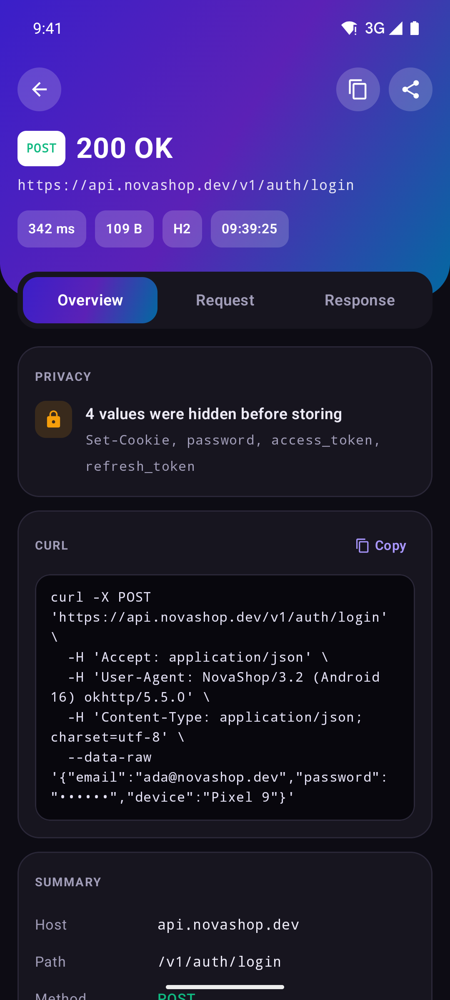

<p align="center">
  
</p>

<p align="center">
  <a href="https://github.com/halilozel1903/WireLens/actions/workflows/ci.yml"></a>
  <a href="https://jitpack.io/#halilozel1903/WireLens"></a>
  
  
  
  
  <a href="LICENSE"></a>
</p>

**WireLens** shows your app's network traffic inside the app. An OkHttp interceptor records every call, and a Jetpack Compose inspector lists them with method, status, duration and size. Open any call to see its headers, query parameters, a syntax-highlighted **JSON viewer** and a **cURL** command you can copy or share. Tokens, cookies and passwords are **redacted before anything is stored**. Shake the device or tap the floating bubble to open it. Meant for debug builds.

```kotlin
val client = OkHttpClient.Builder()
    .addInterceptor(WireLens.interceptor)
    .build()

WireLens.install(application)   // shake to open
```

## Screenshots

Captured from the sample app on an Android emulator by CI, with fixed sample traffic.

| Demo app | Request list | JSON response | Overview and cURL |
| :---: | :---: | :---: | :---: |
|  |  |  |  |
|  |  |  |  |

## Features

- **One interceptor**: add `WireLens.interceptor` to any `OkHttpClient` (Retrofit, Coil, Ktor's OkHttp engine all use one). Method, URL, headers, bodies, status, protocol, timing and errors.
- **Request list** with a gradient header that counts requests, errors, received bytes and the average time; colored method pills, status badges, host, duration, size and time on every card; live updates as calls finish.
- **Search and filters**: search URL, method, status code or error text; filter by 2xx / 3xx / 4xx / 5xx / failed and by method.
- **Detail screen** with *Overview*, *Request* and *Response* tabs: headers, query parameters, bodies, sizes and timing.
- **JSON viewer**: pretty printed with keys in their original order and numbers exactly as sent, syntax highlighted, with line numbers and a copy button.
- **cURL export**: copy or share any request as a `curl` command to repeat it in the terminal.
- **Redaction by default**: `Authorization`, `Cookie`, `Set-Cookie`, API key headers, token-like query parameters (`token`, `api_key`, ...) and JSON fields such as `password`, `access_token` and `refresh_token` are replaced before they reach the store. The overview tells you what was hidden.
- **Never gets in the way**: response bodies are only peeked, so your code reads them as usual; gzip is decoded; streaming responses and one-shot request bodies are recorded without their body.
- **Bounded memory**: bodies are cut at 256 KB (the full size is still shown) and the store keeps the last 500 calls. Both are configurable.
- **Shake to open**, a draggable **floating bubble** with a live count and an error badge, or `WireLensInspector()` anywhere in your own UI.
- **Light and dark** themes of its own, edge to edge, independent from your app's theme.
- **Pure Kotlin core** (`wirelens-core`): the interceptor, store, redaction, cURL, JSON formatting and filtering run on the JVM and are covered by unit tests with MockWebServer.

## Installation

Add JitPack to `settings.gradle.kts`:

```kotlin
dependencyResolutionManagement {
    repositories {
        google()
        mavenCentral()
        maven("https://jitpack.io")
    }
}
```

Then the dependency:

```kotlin
dependencies {
    implementation("com.github.halilozel1903.WireLens:wirelens:1.0.0")
    // Only the interceptor and the logic, without any UI (plain JVM):
    // implementation("com.github.halilozel1903.WireLens:wirelens-core:1.0.0")
}
```

> The build is also set up for Maven Central (`io.github.halilozel1903:wirelens`) via the vanniktech publish plugin.

## Quick start

```kotlin
class ShopApp : Application() {
    override fun onCreate() {
        super.onCreate()
        if (BuildConfig.DEBUG) WireLens.install(this)   // shake to open
    }
}

val client = OkHttpClient.Builder()
    .apply { if (BuildConfig.DEBUG) addInterceptor(WireLens.interceptor) }
    .build()
```

Run the app, make a few requests, then shake the device (in the emulator: **Extended controls › Virtual sensors › Move**, or `adb emu sensor set acceleration 30:30:30` a few times).

Prefer a button? Wrap your content and a draggable bubble appears in the corner:

```kotlin
setContent {
    WireLensOverlay(enabled = BuildConfig.DEBUG) {
        App()
    }
}
```

WireLens is a debugging tool. Keep it behind `BuildConfig.DEBUG` so release builds neither record traffic nor show the inspector.

## Usage

### Options

```kotlin
WireLens.options = WireLensOptions(
    maxBodyBytes = 512L * 1024,
    redactor = Redactor(
        headers = Redactor.DefaultHeaders + "X-Session",
        queryParameters = Redactor.DefaultQueryParameters,
        jsonKeys = Redactor.DefaultJsonKeys + "cardNumber",
    ),
    ignoredHosts = setOf("analytics.example.com"),
)
WireLens.store.maxRecords = 1000
WireLens.isEnabled = false   // stop recording, keep the interceptor
```

| Option | Default | Meaning |
| --- | --- | --- |
| `maxBodyBytes` | 256 KB | Request and response bodies are cut at this size. The full size is still shown. |
| `redactor.headers` | `Authorization`, `Proxy-Authorization`, `Cookie`, `Set-Cookie`, `X-Api-Key`, `X-Auth-Token` | Case-insensitive header names whose values are hidden |
| `redactor.queryParameters` | `token`, `access_token`, `api_key`, `apikey`, `key`, `signature`, `sig`, `password` | Query parameters whose values are hidden in the stored URL |
| `redactor.jsonKeys` | `password`, `access_token`, `refresh_token`, `id_token`, `client_secret`, `token` and camelCase forms | JSON keys, at any depth, whose string values are hidden in bodies |
| `ignoredHosts` | none | Hosts that are never recorded. `example.com` also covers `api.example.com`. |
| `store.maxRecords` | 500 | How many calls are kept; the oldest go first |

`Redactor.None` keeps everything, for example against a local mock server.

### Opening the inspector

```kotlin
WireLens.install(application)          // shake gesture, only while your app is in the foreground
WireLens.open(context)                 // from a debug menu, a notification, a test
WireLensOverlay { App() }              // floating bubble
WireLensInspector(onClose = { ... })   // inside your own screen, tab or dialog
```

`WireLensInspector` handles back navigation, the clipboard and the share sheet. `WireLensScreen` is the same UI without them, for full control over navigation.

### Your own client or store

`WireLens` is a convenience object. The pieces are public, so you can run several independent inspectors:

```kotlin
val store = WireLensStore(maxRecords = 200)
val client = OkHttpClient.Builder()
    .addInterceptor(WireLensInterceptor(store, WireLensOptions(ignoredHosts = setOf("cdn.example.com"))))
    .build()

WireLensInspector(store = store)
```

`WireLensStore.records` is a `StateFlow<List<HttpRecord>>`, newest first, if you want to build something of your own. `SampleTraffic.records()` fills a store with realistic calls for previews and tests.

### cURL, JSON and the other building blocks

Everything the UI uses is plain Kotlin without side effects:

```kotlin
CurlBuilder.command(record)
// curl -X POST 'https://api.example.com/v2/cart/items' \
//   -H 'Accept: application/json' \
//   -H 'Content-Type: application/json' \
//   --data-raw '{"productId":8841,"quantity":1}'

JsonFormatter.prettyPrint(text)                       // keeps key order and number spelling
Redactor().redactJson("""{"password":"hunter2"}""")   // {"password":"••••••"}
RecordFilter(query = "cart 500").apply(records)
WireFormat.bytes(18_841)                              // "18 KB"
WireFormat.duration(84)                               // "84 ms"
```

A request body that was cut or is binary is left out of the cURL command, with a comment line saying so.

## How it works

`WireLensInterceptor` is an application interceptor. Before the call it stores a record with the redacted URL and headers and a copy of the request body (unless the body is one-shot or duplex). After the response headers arrive it peeks up to `maxBodyBytes` of the body, decodes gzip if the server sent it, redacts JSON fields and completes the record. The body your code reads is untouched. A failed call is completed with its error and the exception is rethrown.

The store is a `StateFlow`, so the Compose UI updates as calls start and finish. The shake detector listens to the accelerometer only while one of your activities is resumed.

## Sample app

The `sample` module is a small shop with buttons that send real requests through OkHttp: a product list, a sign in that returns tokens (watch them get hidden), an add to cart, a 404, a 500, a slow call and an image. The WireLens bubble floats above it and shaking the device opens the inspector.

adb can't tap reliably, so for screenshots the sample opens a screen from an intent extra, with fixed sample traffic (used by `scripts/screenshots.sh`):

```bash
./gradlew :sample:installDebug
adb shell am start -n io.github.halilozel1903.wirelens.sample/.MainActivity --es scene list
```

`scene` is one of `home`, `list`, `detail` (a JSON response) or `overview` (redaction and cURL).

## Project structure

| Module | What it is |
| --- | --- |
| `wirelens-core` | Plain Kotlin/JVM: `WireLensInterceptor`, `WireLensStore`, `HttpRecord`, `Redactor`, `CurlBuilder`, `JsonFormatter`, `RecordFilter`, `WireFormat`, `SampleTraffic`. Published as `wirelens-core` |
| `wirelens` | Android and Compose: `WireLens`, `WireLensInspector`, `WireLensScreen`, `WireLensOverlay`, `WireLensBubble`, `WireLensTheme`, `WireLensActivity`. Published as `wirelens` |
| `sample` | A demo shop with screenshot scenes |

## Requirements

- minSdk 24, compileSdk 37
- OkHttp 5 (the interceptor is written against the OkHttp 5 API)
- Kotlin 2.4 · AGP 9.4 · Gradle 9.6 · Jetpack Compose BOM 2026.09 · Material 3

## Contributing

Issues and pull requests are welcome. Please run `./gradlew :wirelens-core:test` before opening a PR.

## License

WireLens is available under the MIT license. See [LICENSE](LICENSE).
